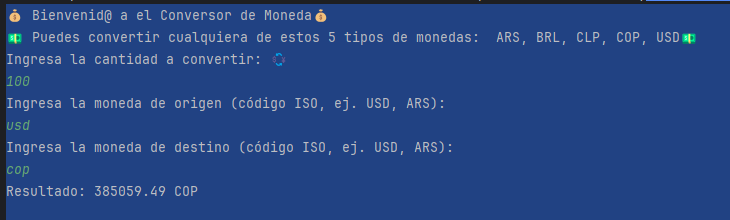

<em> # Conversor de Monedas </em>

## Descripción del proyecto
Este conversor esta desarrollado con Java 21, el cual, podrás 
usar para saber el valor de una moneda y convertirla a otra, 
se usa la api https://www.exchangerate-api.com/docs/java-currency-api
para hacer la conversión en tiempo real, y esta limitada a 5 tipos de 
monedas ("ARS", "BRL", "CLP", "COP", "USD").
Primero debes introducir la cantidad o el monto que deseas convertir
Ejemplo: 100 dólares, luego te pide el código del tipo de moneda que deseas
convertir Ejemplo: USD. y por último te solicita el código de la moneda a la que 
deseas que se convierta Ejemplo: COP. 
Con estos ejemplos estarias convirtiendo 100 dolarés en pesos Colombianos.
y finalmente te muestra el resultado de la moneda convertida. 

